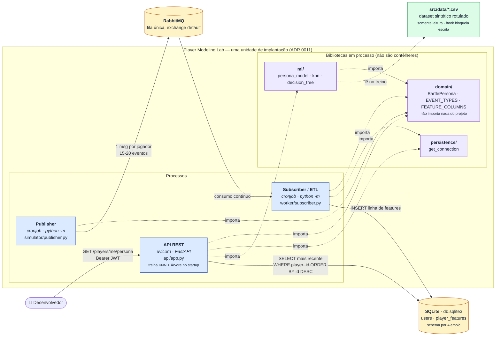

# Player Modeling Lab

POC experimental para **Modelagem de Jogadores (Player Modeling)** utilizando Engenharia de Dados e, posteriormente, Machine Learning.

O projeto faz parte da disciplina **PPGTI1101**, do Programa de Pós-Graduação em Tecnologia da Informação (PPgTI/UFRN), e será desenvolvido de forma incremental ao longo da disciplina.

## Objetivo

O objetivo inicial é construir, com o auxílio de IA, um repositório Python responsável por:

1. rodar um **simulador** (cronjob) que gera eventos sintéticos de jogadores e os publica em uma fila **RabbitMQ**;
2. rodar um **worker** (outro cronjob) que consome os eventos da fila, transforma-os e os persiste em um banco de dados (processo de ETL);
3. disponibilizar ao menos um **endpoint GET** que retorna, a partir dos eventos mais recentes de um jogador, o perfil previsto por um modelo de Machine Learning segundo a **Taxonomia de Bartle** (`Killer`, `Achiever`, `Socializer`, `Explorer`).

Esta versão não inclui frontend nem autenticação/autorização.

A ideia é utilizar esse projeto como um laboratório para experimentar técnicas de Engenharia de Dados, Machine Learning e desenvolvimento de software assistido por Inteligência Artificial.

### Pipeline inicial

```text
Simulador (cronjob)
      │
      ▼
   RabbitMQ
      │
      ▼
Worker / ETL (cronjob)
      │
      ▼
Banco de dados
      │
      ▼
Modelo de ML (Taxonomia de Bartle)
      │
      ▼
Endpoint GET (perfil do jogador)
```

### Arquitetura (C4, nível de contêiner)



Setas cheias são fluxo de dados em execução; setas pontilhadas são dependência de código. Os três
processos são independentes entre si — comunicam-se apenas pela fila e pelo banco. A comparação
entre esta versão do diagrama e uma alternativa em sintaxe `C4Container` está em
[`docs/aula6/etapa5-diagramas.md`](docs/aula6/etapa5-diagramas.md).

## Escopo inicial

A primeira versão do projeto trabalha com dados sintéticos de jogadores, tanto na simulação quanto no pré-treino do modelo.

Os eventos representam ações do jogador durante uma sessão, como:

* movimentação (`move`);
* ataque (`attack`);
* exploração de área (`explore_area`);
* interação social (`chat`, `trade`);
* progressão (`quest_complete`, `quest_fail`, `retry`);
* coleta de itens (`loot`);
* inatividade (`idle`).

Enquanto o pipeline real (simulador → RabbitMQ → worker) não está pronto, o modelo de ML é pré-treinado com um dataset sintético gerado por `src/player_modeling/scripts/generate_raw_events.py`, que produz:

* `src/data/events.csv`: eventos brutos, no mesmo formato que o worker consumiria da fila;
* `src/data/sessions_features.csv`: features agregadas por sessão (percentuais por tipo de evento, tempo médio de decisão, taxa de falha) já rotuladas com o perfil verdadeiro (`true_persona`), usadas para treinar o classificador.

## Evolução planejada

O escopo inicial já cobre simulador, worker/ETL, banco de dados, modelo de ML e endpoint de consulta (ver "Objetivo" acima). Funcionalidades futuras poderão incluir:

1. endpoints adicionais além do GET de consulta de perfil;
2. frontend para visualização dos perfis;
3. autenticação e autorização;
4. análise de importância das features;
5. técnicas de explicabilidade;
6. integração com fontes externas de eventos, como plataformas de jogos reais;
7. experimentos adicionais relacionados à pesquisa de Player Modeling.

Essas funcionalidades **não devem ser implementadas antecipadamente** sem uma solicitação explícita.

## Estrutura do projeto

`src/` agrupa tudo o que é relacionado à implementação do backend (código de domínio, dados de origem e testes). `scripts/`, na raiz, contém apenas as ferramentas de harness.

```text
player-modeling-lab/
│
├── CLAUDE.md
├── README.md
├── docker-compose.yml
├── Makefile
│
├── docs/
│   └── adr/
│
├── scripts/
│
└── src/
    ├── player_modeling/
    │   ├── domain/
    │   ├── persistence/
    │   ├── simulator/
    │   ├── worker/
    │   ├── ml/
    │   ├── api/
    │   └── scripts/
    ├── alembic/
    │   └── versions/
    ├── data/
    └── tests/
        ├── player_modeling/
        │   ├── domain/
        │   ├── simulator/
        │   ├── worker/
        │   ├── ml/
        │   ├── api/
        │   └── scripts/
        └── scripts/
```

A árvore acima lista apenas diretórios e os arquivos de nível raiz do projeto (ver ADR 0009 - granularidade da árvore do README, validada automaticamente por um hook de pré-commit). A responsabilidade de cada diretório está descrita na tabela abaixo, não como lista de arquivos individuais.

### Organização dos diretórios

| Diretório                          | Responsabilidade                                            |
| ----------------------------------- | ------------------------------------------------------------ |
| `src/`                              | Tudo o que é relacionado à implementação do backend           |
| `src/player_modeling/domain/`       | Vocabulário do domínio (Taxonomia de Bartle, tipos de evento, colunas de feature) — não importa nenhum outro módulo (ADR 0011) |
| `src/player_modeling/persistence/`  | Conexão com o banco, compartilhada por API, worker e migrações (ADR 0011) |
| `src/player_modeling/simulator/`    | Cronjob que gera e publica eventos sintéticos no RabbitMQ    |
| `src/player_modeling/worker/`       | Cronjob que consome, transforma e persiste eventos (ETL)     |
| `src/player_modeling/ml/`           | Classificadores de perfil (Bartle): núcleo compartilhado, KNN e Árvore de Decisão |
| `src/player_modeling/api/`          | Endpoint GET de consulta do perfil do jogador                |
| `src/player_modeling/scripts/`      | Scripts executáveis da pipeline/backend (ex.: geração do dataset sintético) |
| `src/data/`                         | Dataset sintético usado para pré-treinar o modelo de ML       |
| `src/tests/`                        | Testes automatizados                                          |
| `scripts/`                          | Ferramentas de desenvolvimento e validação do harness (branch, commit, arquivos sensíveis, diff de escopo) |
| `docs/adr/`                         | Architecture Decision Records                                 |
| `docs/`                             | Documentação complementar                                     |

## Tecnologias

A versão inicial utiliza:

* **Python 3.13**
* **FastAPI** e **Uvicorn** (servidor da API REST assíncrona)
* **PyJWT** e **Bcrypt** (autenticação JWT e hashing seguro de senhas)
* **SQLite** (`db.sqlite3` para persistência inicial e tabela `users`, conforme ADR 0004)
* **RabbitMQ** e **pika** (fila de mensagens entre simulador e worker, ADR 0007)
* um **banco de dados** para persistência dos eventos processados (tecnologia a definir)
* **scikit-learn** (classificador KNN da Taxonomia de Bartle, treinado no startup da API — ADR 0010)
* **Pandas** (carga do dataset de treino e montagem do vetor de features na inferência)
* **Pydantic**
* **Pytest**
* **Git**
* **GitHub**

A stack poderá ser ampliada conforme as necessidades das próximas etapas do projeto.

## Instalação

Clone o repositório:

```bash
git clone <URL_DO_REPOSITORIO>
cd ia-dev-lab
```

Instale as dependências com [Poetry](https://python-poetry.org/) (cria automaticamente um virtualenv em `.venv/`, dentro do projeto):

```bash
poetry install
```

Ative os hooks de pré-commit (formatação, lint, verificação de tipos e testes rápidos rodam antes de cada commit):

```bash
poetry run pre-commit install
poetry run pre-commit install --hook-type commit-msg
```

Copie `.env.example` para `.env` e **gere um segredo JWT** — a API não sobe sem ele (ADR 0012):

```bash
cp .env.example .env
python -c "import secrets; print(secrets.token_urlsafe(48))"   # cole em JWT_SECRET_KEY
```

Opcional — enforcement de TDD durante o desenvolvimento com o agente de IA. O reporter do pytest já vem no grupo `dev`; o binário do hook é instalado à parte:

```bash
npm install -g tdd-guard
```

## Executando os testes

Execute todos os testes com:

```bash
poetry run pytest
```

Para executar um arquivo de teste específico:

```bash
poetry run pytest src/tests/scripts/test_nome_do_teste.py
```

Para rodar manualmente as mesmas verificações do harness (lint, formatação e tipos):

```bash
poetry run ruff check .
poetry run ruff format .
poetry run mypy .
```

Antes de considerar uma tarefa concluída, rode o relatório de escopo para conferir se as alterações estão restritas ao esperado (a branch base padrão é `dev`):

```bash
poetry run python scripts/report_scope_diff.py [branch-base]
```

O comando lista os arquivos alterados em relação à branch base e sinaliza alterações em `src/data/events.csv` ou `src/data/sessions_features.csv`, que nunca devem ser editados manualmente.

## Executando a API e Autenticação

### Makefile

Os comandos do dia a dia estão disponíveis via `Makefile` na raiz (`make help` lista todos os alvos):

```bash
make migrate        # aplica as migrações Alembic até a revisão mais recente
make migrate-down   # reverte a última migração aplicada
make migrate-stamp  # marca o banco na revisão mais recente sem aplicar DDL
make test           # roda a suíte de testes (pytest)
make lint           # roda ruff (check + format) e mypy
make run            # sobe a API FastAPI em modo desenvolvimento (reload)
make rabbitmq-up    # sobe o RabbitMQ via docker-compose (ADR 0007)
make publisher      # roda o worker publisher (gera e publica eventos sintéticos)
make subscriber     # roda o worker subscriber (consome a fila e persiste features)
```

### Aplicando as migrações do banco de dados

O schema do SQLite (`db.sqlite3`) é gerenciado por migrações versionadas com **Alembic** (ADR 0006), não mais criado automaticamente pela API. Antes de subir a API pela primeira vez:

```bash
poetry run alembic upgrade head    # ou: make migrate
```

Se você já possui um `db.sqlite3` criado por uma versão anterior do projeto (com a tabela `users` criada automaticamente pela API), marque-o como já estando na revisão inicial em vez de recriar a tabela:

```bash
poetry run alembic stamp head      # ou: make migrate-stamp
```

Para iniciar o servidor FastAPI da API localmente:

```bash
poetry run uvicorn player_modeling.api.app:app --reload --port 8000    # ou: make run
```

A documentação interativa OpenAPI/Swagger estará disponível em: `http://localhost:8000/docs`.

### Endpoints de Autenticação (ADR 0004 e ADR 0005)

* **`POST /auth/register`**: Cadastra um novo jogador (`name`, `username` formato `player_0000`, `password`). A senha é armazenada com hash bcrypt no banco SQLite (`db.sqlite3` na raiz, schema aplicado via Alembic — ver acima).
* **`POST /auth/login`**: Valida credenciais e emite um JWT Bearer Token (`access_token`).
* **`GET /auth/me`**: Rota protegida por Bearer Token (`Authorization: Bearer <token>`), retornando os dados do jogador autenticado.

### Endpoints de Predição e Jogadores (Taxonomia de Bartle)

* **`GET /players/me/persona`**: Rota protegida por Bearer Token (`Authorization: Bearer <token>`). Não recebe parâmetros: o jogador consultado é sempre o dono do token. Busca a linha mais recente de `player_features` desse jogador e retorna o perfil previsto por **cada** modelo na Taxonomia de Bartle (`Killer`, `Achiever`, `Socializer`, `Explorer`), conforme ADR 0010. Responde `404` quando a pipeline ainda não processou eventos do jogador.

```json
{
  "player_id": "player_0001",
  "knn": "Killer",
  "decision_tree": "Explorer"
}
```

Há um campo por modelo, nomeado pela chave do modelo, para que toda persona retornada seja rastreável ao classificador que a produziu. Os modelos podem divergir — essa divergência é o dado de interesse, e a API não escolhe vencedor nem faz votação.

Os classificadores são treinados uma única vez na subida da API (`make run`), a partir do dataset sintético rotulado `src/data/sessions_features.csv`, e mantidos em memória pelo processo — nenhuma requisição retreina modelo. Como consequência, o servidor não sobe se o dataset estiver ausente ou inválido, nem se `JWT_SECRET_KEY` não estiver definida (ADR 0012).

Para comparar a qualidade dos dois modelos sobre o dataset rotulado:

```bash
PYTHONPATH=src poetry run python -m player_modeling.scripts.evaluate_model
# --model knn | decision_tree | both (padrão: both)
```

## Executando o simulador (worker publisher)

O simulador (ADR 0007) simula dois jogadores de teste fixos, cada um com uma persona da Taxonomia de Bartle sorteada independentemente a cada ciclo, e publica um lote de 15 a 20 eventos recentes de cada um em uma fila RabbitMQ, no formato que o worker subscriber (ver abaixo) consome para gerar as features do modelo. Ele roda em loop contínuo (um ciclo por intervalo configurado), permitindo observar como o perfil previsto de um jogador evoluiria ao longo do tempo e testar isolamento de dados entre os dois jogadores.

Suba o RabbitMQ localmente via Docker Compose (imagem `rabbitmq:3-management`, com painel web em `http://localhost:15672`):

```bash
docker compose up -d    # ou: make rabbitmq-up
```

As credenciais, a fila, os jogadores de teste e o intervalo entre ciclos são lidos de variáveis de ambiente (ver `.env.example`):

* `RABBITMQ_HOST`, `RABBITMQ_PORT`, `RABBITMQ_USER`, `RABBITMQ_PASSWORD`, `RABBITMQ_QUEUE`;
* `PLAYER_USERNAME_1`, `PLAYER_USERNAME_2` — os dois jogadores de teste para os quais o publisher publica a cada ciclo (crie-os, por exemplo, via `POST /auth/register`);
* `PUBLISHER_INTERVAL_SECONDS` — intervalo, em segundos, entre ciclos.

Copie-as para o seu `.env` antes de rodar o publisher.

Execute o publisher (roda em primeiro plano, publicando um ciclo — um lote para `PLAYER_USERNAME_1` e outro para `PLAYER_USERNAME_2` — a cada `PUBLISHER_INTERVAL_SECONDS`, até `Ctrl+C`):

```bash
PYTHONPATH=src poetry run python -m player_modeling.simulator.publisher    # ou: make publisher
```

## Executando o worker subscriber

O worker subscriber (ADR 0008) consome continuamente a mesma fila RabbitMQ do publisher. Para cada mensagem, agrega os eventos em uma linha de features (`n_events`, `pct_attack`, `pct_explore`, `pct_social`, `pct_quest_complete`, `pct_retry`, `avg_decision_time_ms`, `fail_rate` — sem persona) e a persiste como um novo registro em `player_features` (histórico por jogador, indexado por `(player_id, id)` para consultar a linha mais recente com eficiência). Mensagens malformadas são descartadas sem interromper o consumo.

Pré-requisitos: RabbitMQ no ar (`make rabbitmq-up`) e a migração aplicada (`make migrate`, ver seção seguinte).

Execute o subscriber (roda em primeiro plano, consumindo até `Ctrl+C`):

```bash
PYTHONPATH=src poetry run python -m player_modeling.worker.subscriber    # ou: make subscriber
```

## Dados

A versão inicial utiliza **dados sintéticos**.

Enquanto o pipeline real (simulador → RabbitMQ → worker) não está pronto, o modelo de ML é pré-treinado com o dataset gerado por `src/player_modeling/scripts/generate_raw_events.py`:

```text
src/data/events.csv             # eventos brutos sintéticos
src/data/sessions_features.csv  # features agregadas por sessão, rotuladas com true_persona
```

Esses arquivos não devem ser editados manualmente nem sobrescritos pelo pipeline; para regerá-los, execute novamente o script gerador.

Quando o pipeline real estiver implementado, os eventos publicados pelo simulador e consumidos pelo worker devem ser persistidos em banco de dados, não em arquivos.

## Desenvolvimento assistido por IA

A Inteligência Artificial é utilizada como ferramenta de apoio ao desenvolvimento do projeto.

Entre as atividades realizadas com auxílio de IA estão:

* geração e revisão de código;
* criação de testes;
* análise de arquitetura;
* documentação;
* refatoração;
* análise de dados;
* geração de prompts de desenvolvimento.

Todo código gerado ou modificado com auxílio de IA deve passar por revisão humana antes de ser incorporado ao projeto.

Dois hooks técnicos do Claude Code (`.claude/settings.json`, ver `docs/adr/0003-harness-desenvolvimento.md`) bloqueiam ações do agente de IA antes da execução, inclusive se solicitadas na conversa:

* **`git push`** é bloqueado incondicionalmente — o push para o repositório remoto é sempre uma ação manual do desenvolvedor, após revisão (`git commit` e `git merge` locais não são afetados);
* **escrita nos dados de origem** (`src/data/events.csv`, `src/data/sessions_features.csv`) é bloqueada, por ferramenta de edição ou por shell — leitura e a regeneração oficial via `generate_raw_events.py` continuam permitidas.

As regras e o contexto para desenvolvimento assistido por IA estão documentados em [`CLAUDE.md`](./CLAUDE.md).
