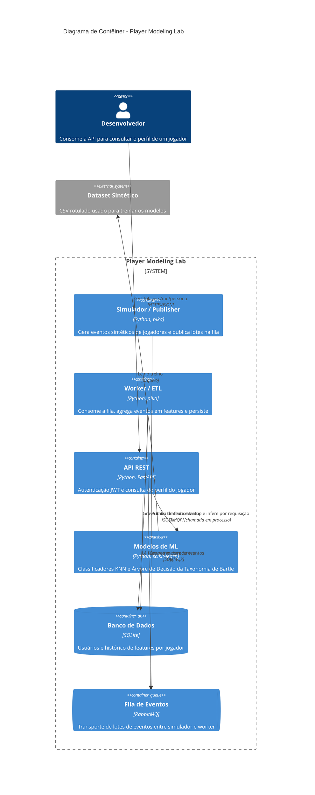
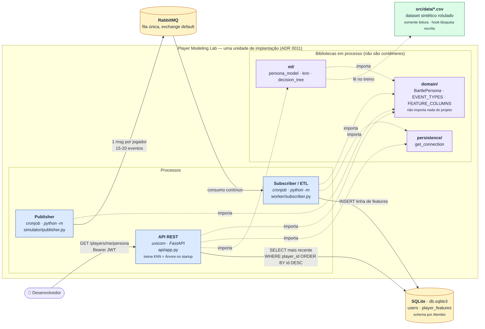

# Etapa 5 — Diagrama C4 de contêiner: duas abordagens

A atividade pede um diagrama C4 de nível de contêiner gerado com apoio de IA, e depois o **mesmo**
diagrama gerado de uma segunda forma, para comparar qual comunica melhor a arquitetura.

## Versão 1 — sintaxe nativa `C4Container` do Mermaid, prompt genérico

Prompt usado: *"Gere um diagrama Mermaid no nível de contêiner do modelo C4 para este projeto."*

### O que essa versão acerta e o que ela erra

Acerta a **forma**: usa a notação oficial do C4, distingue pessoa, sistema, contêiner, banco e fila,
e nomeia as tecnologias e os protocolos. É o que se espera de um diagrama C4 de contêiner, e um
leitor que conhece a notação se orienta nela imediatamente.

Erra em três pontos, todos derivados de o prompt não ter dado contexto do projeto:

1. **`ml/` aparece como contêiner.** Não é. Um contêiner, no C4, é algo que executa separadamente —
   um processo, um serviço, um banco. `ml/` é um pacote Python importado em processo pela API. Ele
   sobe e cai junto com o `uvicorn`. Representá-lo como caixa irmã da API sugere exatamente a
   arquitetura que a ADR 0011 **rejeitou** (serviço de inferência separado).
2. **O dataset aparece como sistema externo.** É um arquivo versionado dentro do próprio
   repositório, não um sistema de terceiros.
3. **Os dois cronjobs parecem serviços sempre ligados.** Nada no diagrama diz que publisher e
   subscriber são processos de ciclo, rodados manualmente ou por cron.

Ou seja: o diagrama está correto na sintaxe e **errado na fronteira do que é um contêiner** — que é
justamente a única pergunta que o nível de contêiner do C4 existe para responder.

## Versão 2 — `flowchart` ajustado à mão, com o contexto da ADR 0011

Segunda abordagem: em vez de outro prompt genérico, o diagrama foi refeito com o contexto que a
revisão arquitetural produziu (quem é processo, quem é biblioteca, quais camadas são compartilhadas)
e ajustado manualmente sobre o resultado da IA.

### O que muda

* **A fronteira certa aparece.** Processos (azul) e bibliotecas em processo (roxo) ficam
  visualmente separados, e tudo está dentro de uma caixa que diz explicitamente "uma unidade de
  implantação". A decisão da ADR 0011 é legível no desenho.
* **Setas cheias são fluxo de dados em runtime; setas pontilhadas são dependência de código.**
  A versão 1 usava o mesmo tipo de seta para "publica na fila" e para "chama em processo".
* **A camada de domínio aparece,** com a regra que a define escrita dentro da caixa. Todas as
  dependências apontam para ela e nenhuma sai dela — a correção da Etapa 4 é visível.
* **Detalhes operacionais reais:** a query que a API usa, o tamanho do lote publicado, o fato de o
  schema ser do Alembic, e o hook que bloqueia escrita no dataset.

### O que piora

A versão 2 **não é C4 canônico**. Ela abandona a notação oficial (`Person`, `Container`,
`ContainerDb`) por um `flowchart` com estilos manuais. Um revisor que espera C4 estrito vai notar; e
ela mistura dois níveis — contêineres e pacotes internos — que o C4 separa deliberadamente em níveis
3 e 4. Também é mais densa: tem mais texto por caixa e não caberia bem em um slide.

## Comparação e escolha

| | **V1 — `C4Container`, prompt genérico** | **V2 — `flowchart` ajustado com contexto** |
|---|---|---|
| Aderência ao C4 | alta (notação oficial) | baixa (flowchart estilizado) |
| Fronteira de contêiner | **errada** — trata `ml/` como contêiner | correta — separa processo de biblioteca |
| Distingue runtime × dependência de código | não | sim (seta cheia × pontilhada) |
| Mostra a decisão arquitetural | não — sugere o contrário dela | sim, explicitamente |
| Densidade | leve, cabe em slide | densa, é documento |
| Esforço | um prompt | contexto da revisão + ajuste manual |

**Escolhida para o README: a versão 2.**

O critério foi: *qual diagrama faria alguém tomar a decisão certa ao mexer neste projeto?* A versão 1
é mais bonita e mais ortodoxa, mas quem a lê conclui que existe um serviço de ML — e pode tentar
"apenas" colocá-lo atrás de HTTP, que é precisamente o movimento que a ADR 0011 rejeita com
justificativa. Um diagrama que induz a decisão errada é pior que um diagrama feio.

O aprendizado real da comparação não foi sobre sintaxe: foi que **a qualidade do diagrama gerado por
IA foi determinada pela qualidade do contexto, não pelo modelo nem pela ferramenta**. O mesmo agente,
com o mesmo modelo, produziu um diagrama com a fronteira errada quando recebeu "gere um C4 deste
projeto", e um diagrama correto quando já tinha feito a análise de dependências e conhecia a decisão
da ADR. A IA não sabia o que era contêiner e o que era pacote — e, sem contexto, chutou pela
estrutura de diretórios.
